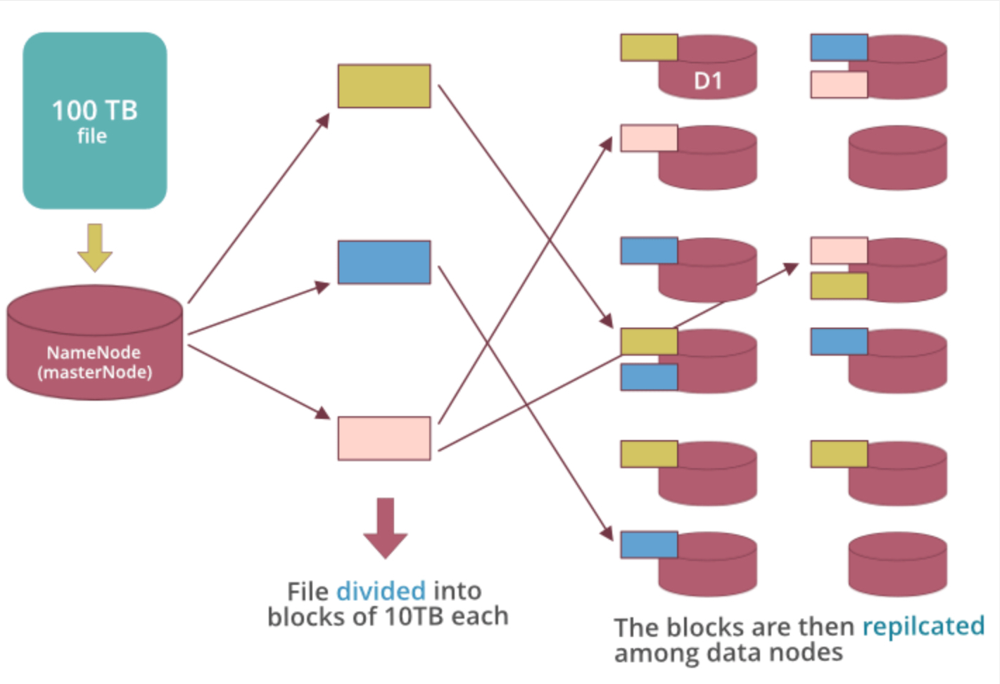

HDFS è un database distribuito ([DFS](./../UsefulGeneralNotes/DistributedFileSystem.md)) capace di fornire uno storage per file di enormi entità ed un accesso streaming utilizzando **commodity hardware**.
**Key Concept**:
- *Extremly large files*: dati nell'ordine di petabyte;
- *Streaming Data Access Pattern*: principio **write-once-read-many-times**;
- *Commodity Hardware*: Hardware dal costo esiguo e con alta disponibilità nel mercato.

# Architettura
HDFS si basa su un architettura *Master/Slave*, in cui è presente un singolo *NameNode* (**MasterNode**) ed un numero variabile di *DataNodes* (**SlaveNodes**):
- *MasterNode*:
	- Gestisce gli slave assegnando loro task e risorse;
	- Esegue operazioni di filesystem quali creazioni, rimozioni, modica ecc;
	- Sempre eseguito su hardware "sicuro", ovvero performante e con alta affidabilità
- *SlaveNode*:
	- Esegue i task assegnati dal master node;
	- Operazioni di filesystem (solo sotto indicazione del master);
	- Eseguito su commodity hardware.

Su queste macchine runnano due tipi di deamon:
1. Namenodes:
	1. Eseguito sul master node;
	2. Salva i metadata come path file, numero di blocchi, id dei blocchi ecc;
	3. Richiede alta quantità di RAM;
	4. Salva i metadata nella RAM per un recupero efficiente e veloce. Una copia di esso è salvato nel disco in modo persistente.
2. DataNodes:
	1. Eseguito sui slave nodes;
	2. Richiede tanta memoria quanto quella richiesta dai dati che deve elaborare.
****
# Data Storage
Anche i dati sono distribuiti trai vari nodi del cluster, rispecchiando alcune caratteristiche.
|Example|Explanation|
|-|-|
||**Esempio**. Assumiamo che il sistema debba ingestire 100 TB di dati, Questi vengono *divisi* dal MasterNode in **BLOCKS** di 10 tb, i quali vengono salvati tra i diversi nodi. Questi blocchi vengono *duplicati* tra gli slave. Ogni nodo invia info sui blocchi ingestati al master.|

Dall'esempio si evince che il master node ha info su tutto: la location di ogni nodo più i blocchi che esso contiene. In questo modo esso è in grado di gestire tutti i dati.

**Key Concepts**:
- **Blocchi**: I dati vengono divisi in blocchi per varie ragioni. Prima osservazione è che salvare enormi file risulterebbe difficile, un altro problema sarebbe in fase di lettura o di modifica. La divisione in blocchi permette una lettura di un numero minore di dati. In più la divisione permette la **REPLICATION**. Ogni blocco viene salvato in diversi nodi in modo tale da poter essere recuperati anche in caso di perdità di uno dei nodi (*Faul Tolerance*). Lo stesso blocco non può essere replicato sullo stesso nodo;
- **Heart Beat**: Il segnale che ogni data node invia al name node. Se non viene ricevuto il nodo è considerato morto;
- **Balancing**: Se un nodo muore i blocchi su di esso vengono ridulicati per tornare al valore di replication settato inizialmente;
- **Replication**: Duplicazione dei blocchi tra i vari datanode.

# Features
Le features di HDFS sono per lo più quelle fornite da un DFS:
1. Storage Distribuito;
2. Blocchi per velocizzazione di I/O;
3. Dati sempre disponibili;
4. Fault Tolerance;
5. Alta affidabilità.

# Limiti
1. Difficoltà nell'accesso ai dati in bassa latenza;
2. Problema con i piccoli file: inefficiente in questo caso.

HDFS fornisce comandi da terminale propri utili per la creazione di file, cartelle e la navigazione nei vari nodi.

# Link
[Design](https://hadoop.apache.org/docs/r1.2.1/hdfs_design.html)
[Commands](https://hadoop.apache.org/docs/stable/hadoop-project-dist/hadoop-hdfs/HDFSCommands.html)
---

**Tag Obsidian:** #database #BigData #apache 
