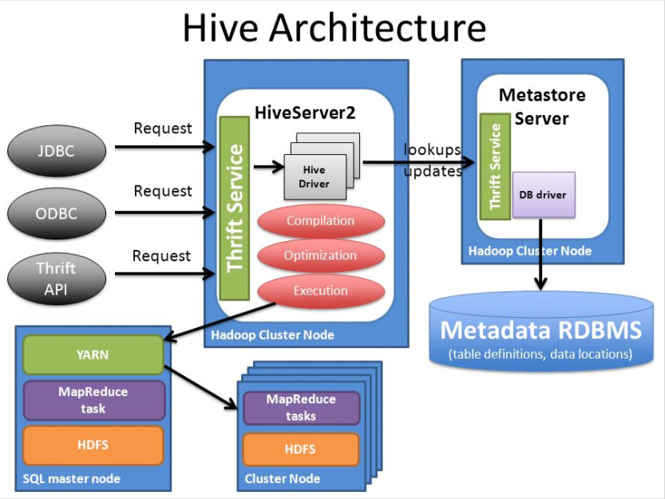

Hive è un software di **data warehouse** che i pone lo scopo di facilitare la scrittura, la lettura e la gestione di ampi dataset in un DFS ([DistributedFileSystem](./../UsefulGeneralNotes/DistributedFileSystem.md)) tramite l'ausilio di linguaggio SQL.

Hive è costruito su database Hadoop e fornisce le seguenti features:
- tools per l'accesso ai dati via SQL con scopi di ETL, reporting o analisi
- Un meccanismo per imporre una struttura comune ad un insieme di dati i diversa natura (Hbase, [HDFS](./HDFS.md) o altro)
- Accesso diretto ai dati (ad esempio con external table)
- Esecuzione di query tramite tool quali Spark, Map Reduce o Tez
- Linguaggio Procedurale **HPL-SQL**

Hive fornisce un interfaccia SQL che fornisce anche la possibilità di estensione tramite l'ausilio di **UDF**, **UDAF** e **UDTF**, inoltre è in grado di leggere vari formati quali Parquet, ORC ecc...

Hive **non è ideale** per **OLTP** ma **è indicato** per un sistema **OLAP**. Hive massimizza la scalabilità, le performance, l'estendibilità e il fault tolerance. Hive si basa su due concetti:
- **HCATALOG**: una tabella di storage management, si occupa di garantire una lettura ed una scrittura più efficiente e semplice
- **WEBHCAT**: un servizio che permette l'esecuzione di Job di diversa natura (MapReduce, Hive, Pig, Spark, ecc)

Lo scopo primario di Hive è dunque quello di dare **una struttura comune** ad un insieme di dati, anche non strutturati, per poter poi usare SQL su di essi, rimuovendo la necessità di dover conoscere linguaggi di programmazione o tool quali SPARK, MapReduce, Java, Scala e così via.



### Tipi di tabelle
In Hive ci sono 2 tipi di tabelle: **Managed** ed **External**
#### Managed
In questo tipo di tabelle sia i dati che gli schemi sono gestiti da Hive. I dati sono su una cartella su HDFS in un file. La location può essere configurata dall'utente durante la fase di installazione di Hive, quella di default è  `/user/hive/warehouse`. Se una tabella di tipo managed viene eliminata verranno eliminati sia i dati che gli schemi.
```sql
CREATE TABLE IF NOT EXISTS stocks (exchange STRING,
symbol STRING,
price_open FLOAT,
price_high FLOAT,
price_low FLOAT,
price_adj_close FLOAT)
ROW FORMAT DELIMITED FIELDS TERMINATED BY ',' ;
```

#### External
Sono tabelle in cui solo lo schema è gestito da Hive, la vita dei dati resta indipendente ad Hive.
```sql
CREATE EXTERNAL TABLE IF NOT EXISTS stocks (exchange STRING,
symbol STRING,
price_open FLOAT,
price_high FLOAT,
price_low FLOAT,
price_adj_close FLOAT)
ROW FORMAT DELIMITED FIELDS TERMINATED BY ','
LOCATION '/data/stocks';
```

| MANAGED | EXTERNAL|
|---|---|
|Hive è owner della vita dei dati|Hive non è owner della vita dei dati |
|Se una tabella è eliminata sia i dati che i metadati vengono eliminati|Drop sulla tabella o su partizioni non eliminano i dati ma solo i metadata|
|Hive salva i dati nel suo warehouse|Hive salva i dati nella location specificata durante la creazione|
|Garantisce il supporto ACID delle transazioni|Non garantisce il supporto ACID|
|Supporta statement: ARCHIVE, UNARCHIVE, TRUNCATE, MERGE, CONCATENATE|Non supporta statement|
|Supporta la cache per le query|Non supporta la cache|
## Link
- https://cwiki.apache.org/confluence/display/Hive//Home
- https://www.guru99.com/introduction-hive.html#2
---
**Tag Obsidian:** #database #datawarehouse #apache #BigData