# Introduction

Databrics è una piattaforma **LAKEHOSE** multicloud, basata su [Apache Spark](https://spark.apache.org/).


Per Lakehouse si intende un ibrido tra un Data Lake ed un Data Warehouse. Esso infatti è una piattaforma analitica che combina i migliori pregi di un Data Lake e di un Data Warehouse fornendo una singola piattaforma con i vantaggi di entrambi


# Architettura Databricks

L'architettura di un Lake House si divide in tre livelli fondamentali:
- Cloud Service
- Runtime
- Workspace

Il **Cloud Service** è gestito da un provider esterno, i più famosi sono: AWS, GCP e AZURE.
Il **Runtime** è l'insieme dei componenti del core:
- Spark
- Delta lake
- Altre librerie

Il **workspace** è l'ambiente che permette di interagire interattivamente tramite workloads.

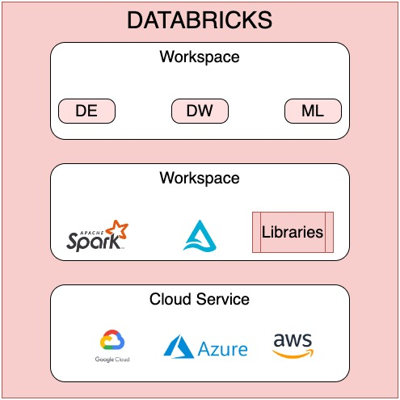

# Come sono deployate?

Vi sono due componenti di alto livello in Databricks:
- **CONTROL PLANE**
- **DATA PLANE**.

Il primo è legato all'account Databricks mentre il secondo è legato alla sottoscrizione cloud.

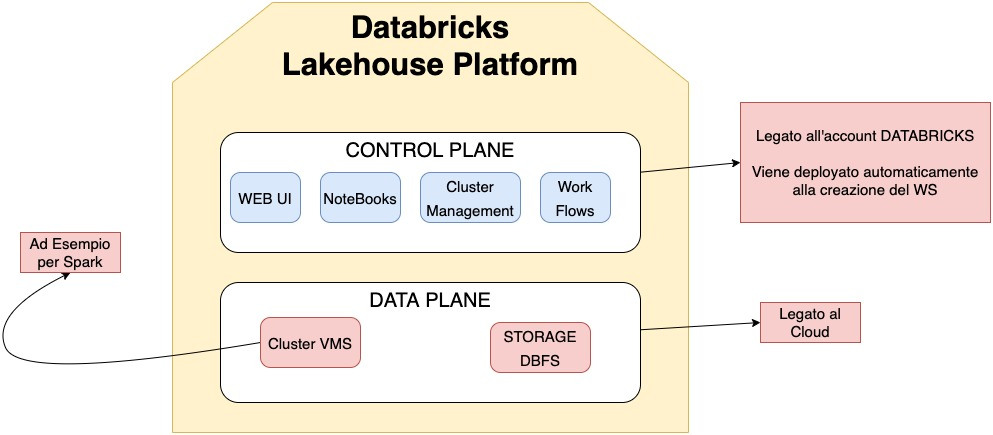

## Spark su Databricks
Essendo sviluppato dallo stesso team di Spark, databricks supporta tutte le funzioni di SPARK:
- In memory distributed data processing
- Tutti i linguaggi supportati da spark:
	- python
	- scala
	- java
	- sql
	- R
- Batch e Streaming
- Dati strutturati, semi e non strutturati
## Databricks File System
Databricks mette a disposizione il suo [DFS](./../UsefulGeneralNotes/DistributedFileSystem.md). Esso viene preinstallato e prende il nome di  **DBFS**. In realtà non è un vero e proprio DFS, ma è un layer di astrazione, esso usa infatti lo storage messo a disposizione dal cloud scelto per memorizzare i dati, ma fornisce all'interno della piattaforma una interfaccia unica.

# Delta Lake
Delta Lake è un framework di storage open source che permette a Databricks di essere affidabile. I Data Lakes hanno però alcune limitazioni quali l'inconsistenza e performance. 

Delta Lake si pone come obiettivo quello di rimediare a questi problemi. Esso è:
- Open Source => no proprietari
- Storage Framework Layer => Non c'è un formato prefissato
- Permette di creare LakeHouse => Nessun DB o DW

Il componente Delta Lake viene deployato automaticamente sul cluster come parte del runtime di Databricks. 
Quando viene creata una tabella DeltaLake essa può essere salvata in storage tramite uno o più file **PARQUET**. Insieme a questo file viene creato un file fondamentale, il *Transaction Log*.

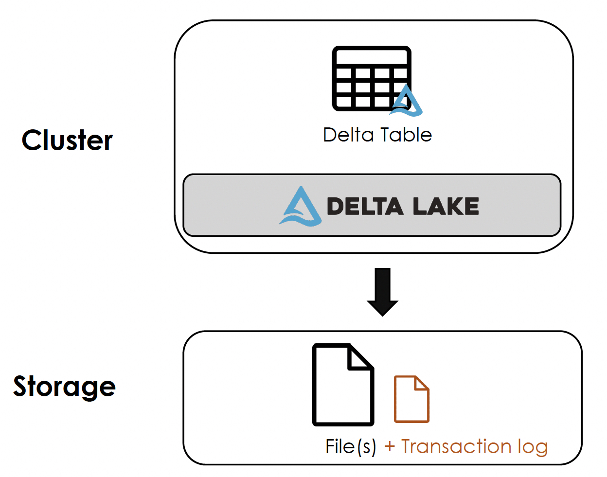

## Transaction Log

Il transaction log, o **Delta Log**, si occupa di tenere traccia dei cambiamenti dei dati. Ordina i records di ogni transazione eseguita sulla tabella e viene considerato come **SINGOLA SORGENTE DI VERITA**. Esso viene usato per ricavare l'ultima versione dei dati da servizi quali Spark o notebooks. Ogni transazione è committata tramite un Json file contenente informazione su:
- operazione effettuata + **Predicate** (operazione e filtri)
- file dei dati annessi alla transizione

Il transaction log permette di leggere sempre l'ultima versione del file, evita dead lock e letture sporche.

### Operazioni

#### Lettura e Scrittura
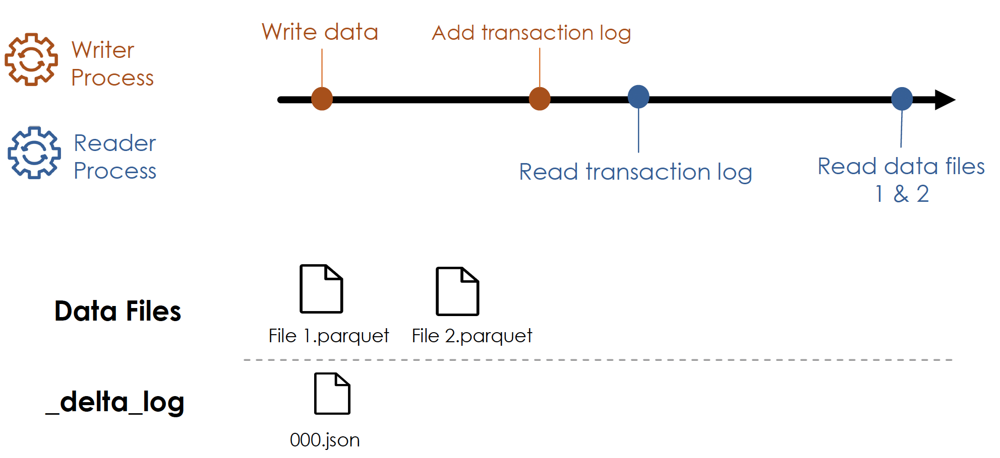
#### Update

#### Lettura e Scrittura simultanea
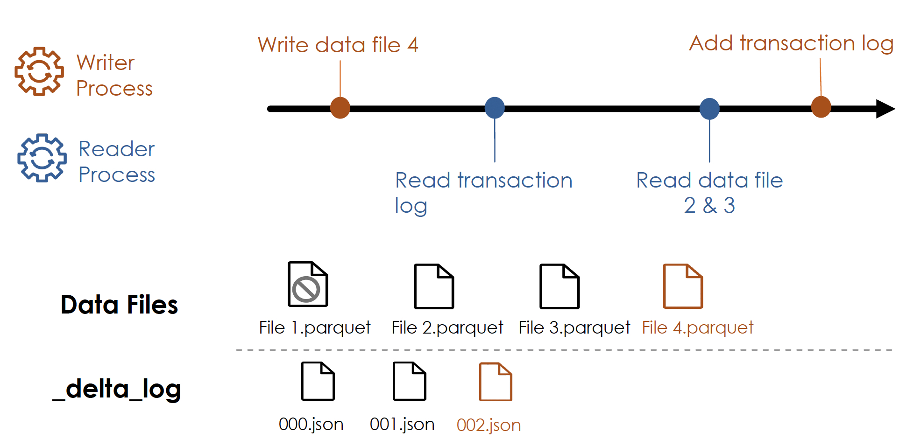
#### Scrittura fallita
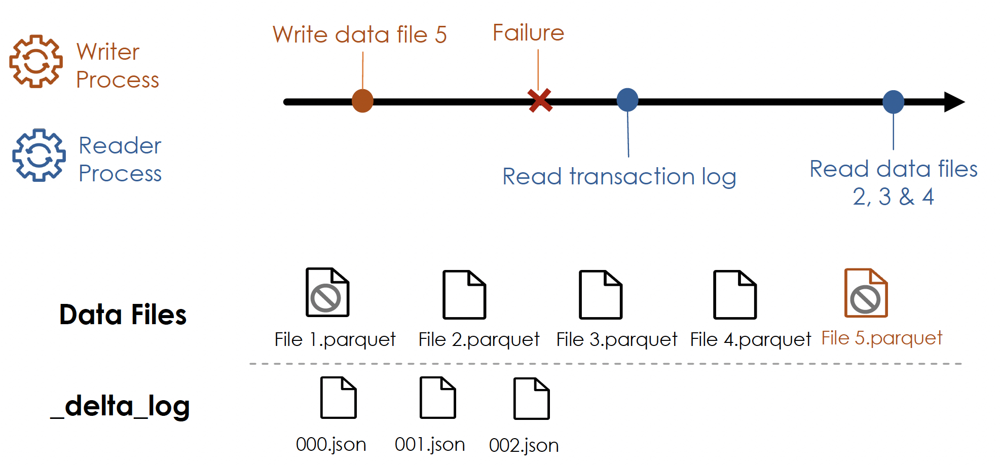

### Vantaggi Transaction Log
Il delta log permette a delta lake di:
- Rispettare i principi [ACID](https://it.wikiversity.org/wiki/Propriet%C3%A0_ACID) in un object storage
- Avere dei metadata scalabili
- Avere uno storico completo di tutti i cambiamenti
- Costruito su un data format standard: Parquet e Json

## Time Travel
Come spiegato Delta Log dà la possibilità di tenere uno storico completo delle modifiche. Vi è la possibilità di interrogare i dati in un preciso momento, utilizzando il **version number** o un **timestamp**.

Tramite timestamp:
```
SELECT * FROM mytable TIMESTAMP AS OF "2020-01-01"
```

Tramite version number:
```
SELECT * FROM mytable VERSION AS OF 17
```
oppure
```
SELECT * FROM mytable@v17
```


In questo modo è possibile effettuare un rollback in caso di necessità direttamente alla versione desiderata:
```sql
RESTORE TABLE mytable AS [version_number|timestamp]
```

Per visionare la storia della tabella:
```
DESCRIBE HISTORY mytable
```

Per visionare la storia della tabella:


## Compaction
Delta Lake fornisce il comando **optimize**. Esso permette di compattare i file aumentando le performance della tabella. Si può specificare un **zorder**, un parametro che permette di raggruppare nello stesso file i dati simili. (CONCETTO DI BUCKETING)

```
OPTIMIZE mytable
```

## Vacuum
Il comando **vacuum** permette di effettuare pulizia dei dati, rimuovendo magari i file non più utilizzati o committati.
Questo comando può essere usato per recuperare molto spazio. Il comando prende un input la **RETENTION**, ovvero il periodo dei dati che **deve** essere mantenuto. Il valore di default è 7 giorni.

```
VACUUM mytable [retention period]
```

Una volta utilizzato Vacuum ovviamente non è più possibile effettuare time travel precedenti al periodo di retention.

# Relation Entities
La gestione dei database e della tabella è uguale a quella di [Hive](./../Apache/Hive.md). L'unica differenza è che abbiamo i delta log.

## Tabelle
### Set up tabelle
Una tabella può essere creata con:
- create statement
- create da risultato di query (**CTAS**)
Nel secondo caso lo schema viene inferito automaticamente, non può essere passato manualmente. Possono essere specificati:
- COMMENT
- PARTITIONED BY
- LOCATION
### Table Contraints
Databricks supporta due tipi di contraints:
- NOT NULL
- CHECK
### Cloning
Esistono due tipi di clonazione:
- **Deep Cloning**: copia sia i dati che i metadata di una tabella.
- **Shallow Clone**: copia solo i delta logs.

Nessuno dei due ha effetti sulla tabella sorgente.

## Views
Non è altro che una tabella virtuale che non ha dati fisici, una query eseguita ogni qualvolta viene richiamata.
```
CREATE VIEW my_view AS SELECT * FROM my_table
```
Vi sono:
- Stored views: oggetti persistiti =>  ```sql CREATE VIEW view_name AS query```
- Temporary views: vivono nella specifica sessione => ```sql CREATE TEMP VIEW view_name AS query```
- Global temporary views: legato alla vita del cluster, ogni componente dello stesso può usufruirne => ```sql CREATE GLOBAL TEMP VIEW view_name AS query```

### Versus
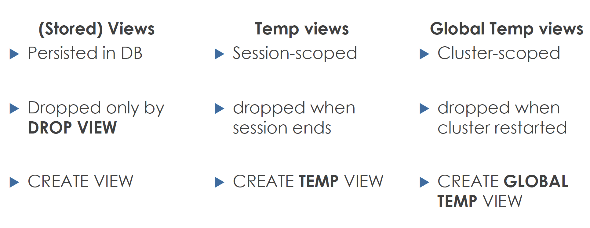

***

# Gestione File
In databricks è possibile interrogare direttamente i file ```SELECT * FROM file_fromat.’path_to_file’```
Vi sono due tipi di file:
- **auto descrittivi**: avro, parquet, json ecc
- **non auto descrittivi**: csv, txt, tsv ecc

Si ha la possibilità di:
- leggere un singolo file: ```usr/dir/file1.json```
- Leggere un intera directory: ```usr/di```
- usare le **wildcards**: ```usr/dir/file*.json```

Ciò può essere utile per estrarre dai file dei **raw data**, sui quali potremo poi applicare funzioni di ELT/ETL, per evitare o correggere dati corrotto. Possiamo leggere file basati su testo o non strutturati:
- file basati su testo: ``` SELECT * FROM text.`path_to_file` ```
- file non strutturati: ``` SELECT * FROM binaryFile.`path\to\file` ```

## Creare Tabelle da file
Per caricare dati con file come sorgente in una delta table si può usare semplicemente il **CTAS**: ``` CREATE TABLE table_name AS SELECT * FROM file_format.`path\to\file` ```.
Tramite esso lo schema verrà inferito automaticamente, esso **non potrà** essere specificato manualmente. Risulta utile dunque preferibile usarlo con file strutturati.

Per ovviare a questi problemi si necessità la creazione di tabelle **EXTERNAL**, rinunciando però alle delta table:
```sql
CREATE TABLE table_name(col1 col_type1, ...)
USING CSV
OPTIONS(header="true",delimiter=";",...)
LOCATION= path\to\files
```

Le External Table utilizzano una sorta di CACHE, è dunque importante ricordarsi di usare il comando `REFRESH` se si effettuano operazioni sulle location.

### Scrittura

| Statement                                                                                                                                                                                                                                           | Description                                                                                                                                                                                                                                                       |
| --------------------------------------------------------------------------------------------------------------------------------------------------------------------------------------------------------------------------------------------------- | ----------------------------------------------------------------------------------------------------------------------------------------------------------------------------------------------------------------------------------------------------------------- |
|                                                                                                                           | In questo modo siamo in grado di creare una **delta table**                                                                                                                                                                                                       |
|                                                                                                                                     | In questo modo siamo in grado di **sovrascrivere completamente** una tabella, evitando duplicati o problemi di schema                                                                                                                                             |
|   | Tramite l'insert overwrite possiamo sovrascrivere una tabella senza doverla ricreare, unico inconveniente è che se lo schema dei dati che stiamo inserendo non è lo stesso di quello delle tabella avremo un errore. Il secondo statement andrà dunque in errore. |
|                                                                                                                                                   | Con un semplice insert invece, oltre al problema dell'insert overwrite, abbiamo l'inconveninente dei duplicati. Esso infatti non garantisce che non ci siano duplicati                                                                                            |
|                             | Si può usare il **merge** per ovviare al problema dei duplicati. In caso di formato auto descrittivo si può usare il primo statement, quando invece il formato non è descrittivo bisogna usare il secondo statement, specificando lo schema                       |

### Trasformazioni avanzate


### UDF e High Order Functions


---
# Incremental Data Processing

Per **data stream** si intende ogni sorgente di dati che **incrementa nel tempo**:
- Arrivo di nuovi file in una cartella
- Update in un DBfs
- Eventi in uno strumento di messaggistica PUB\SUB

Davanti a questo caso d'uso abbiamo due possibili approcci:
1. Ricalcolare ogni volta la foto al momento attuale
2. Gestire solo gli aggiornamenti

Grazie a **spark streaming** è possibile gestire il secondo approccio, esso permette di interrogare **data source infinite** per intercettare i nuovi dati

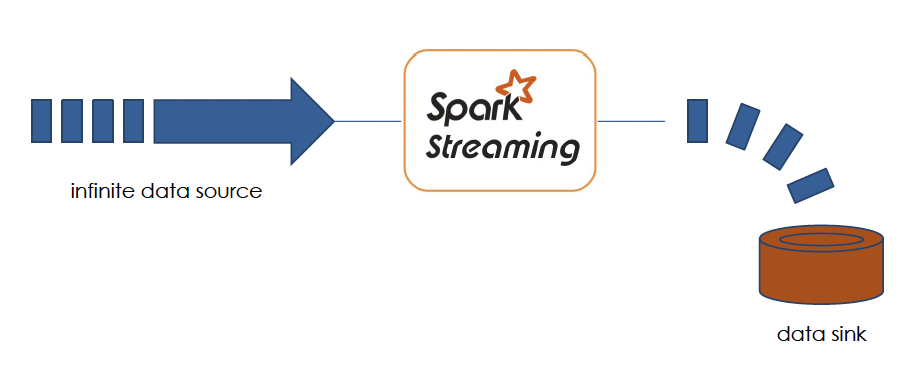

Spark Streaming tratta i nuovi record come aggiunta ad una tabella statica, ogni nuovo dato viene considerato come una nuova riga all'interno di questa tabella. Questa tabella è infinita, e viene detta appunto: ***unbounded table***

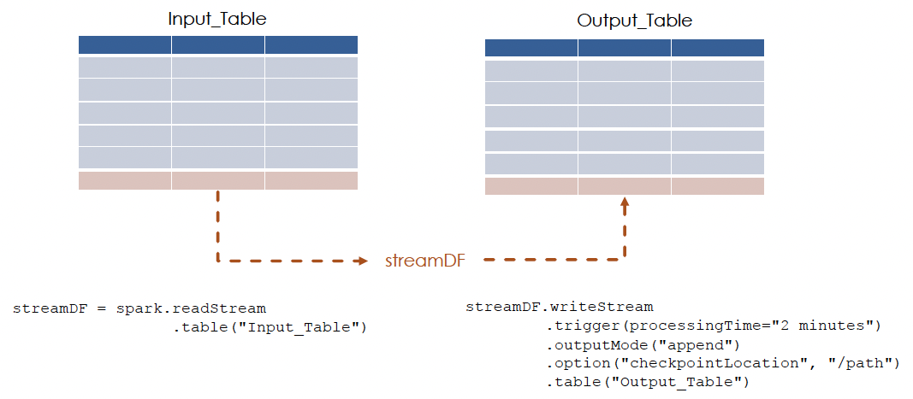 

Spark streaming legge da una tabella sorgente per poi scrivere in una tabella target.

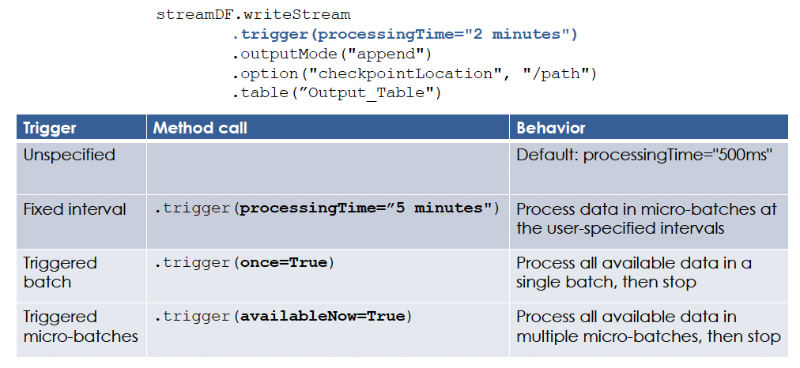 

Si può decidere l'intervallo di tempo di elaborazione dei **micro batch**

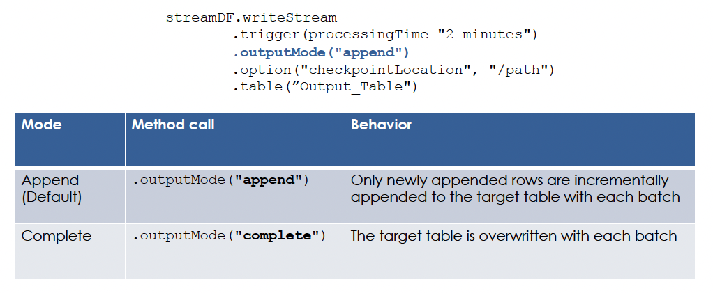 

Si può decidere la modalità di storicizzazione

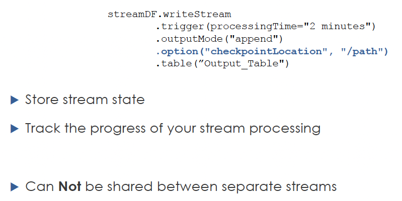 

I checkpoint sono molto importanti, in quanto permettono di tracciare ogni operazione effettuata, rendendo possibile il fail over. 

Spark Streaming è infatti in grado di gestire le interruzioni improvvisi, garantendo **FAULT TOLERANCE** e **IDEMPOTENZA DI SINCRONIZZAZIONE**. 
Esso **non** è però in grado di garantire:
- ordinamento
- deduplica
Per ovviare a questi problemi si può ricorrere a metodologie di supporto come **Windowing** e **Water Marking**

## Esempi

| statement                                                                                                    | description                                                                                                                                                                     |     |
| ------------------------------------------------------------------------------------------------------------ | ------------------------------------------------------------------------------------------------------------------------------------------------------------------------------- | --- |
| 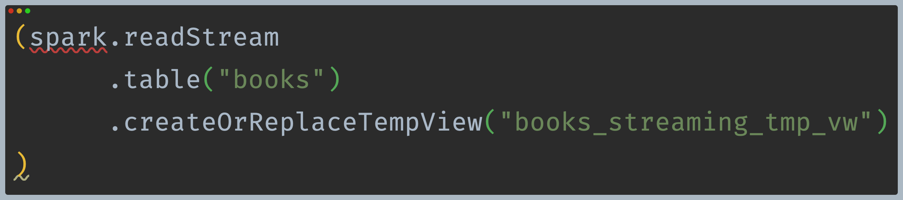                 | Leggiamo dalla tabella sorgente                                                                                                                                                 |     |
| 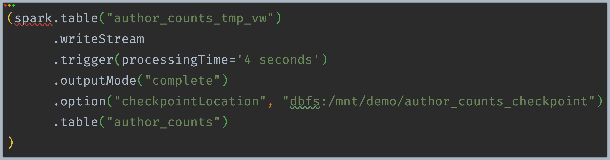               | Gestiamo la scrittura:<br/>- Elaboriamo i dati ogni 4 secondi<br/>- Overwrite;                                                                                                  |     |
| 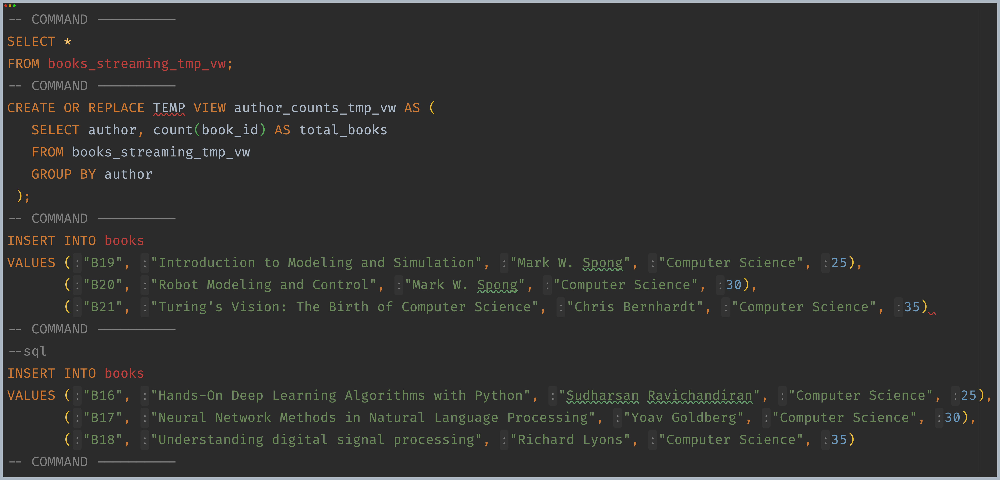 | Viene creata una query streaming, girerà finchè non viene fermata <br/><br/> Creiamo una nuova view streaming su quella precedente <br/><br/> Aggiungiamo nuovi record per test |     |
| 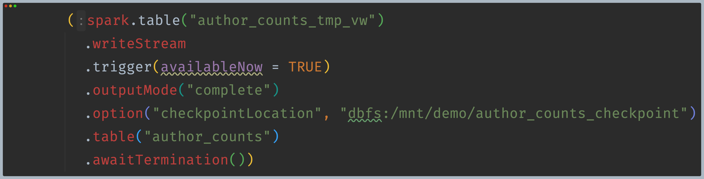           | Elaboriamo solo i nuovi record inseriti. Se si visualizzano le view streaming vedremo che si sono aggiornate, cosi come le tabelle di output                                    |     |

# Data Ingestion da Files
Si intende l'abilità di caricare dati da file aggiunti dopo l'ultima ingestion, riducendo **ridondanza**, elaborando file già elaborati. Databricks mette a disposizione due metodi:
1. COPY INTO
2. AUTO LOADER

## COPY INTO
Non è altro che un comando SQL che permette di caricare file da una location ad una delta table. Si tiene traccia di quelle elaborate in modo da poterli skippare nelle run succesive

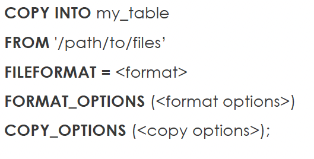 

## AUTO LOADER
Usa spark streaming per processare nuovi dati da files come essi vengono caricati in una location. Basandosi su SPARK, usa i checkpoint per tener traccia delle operazioni, garantendo EXACTLY ONE e FAULT TOLERANCE.
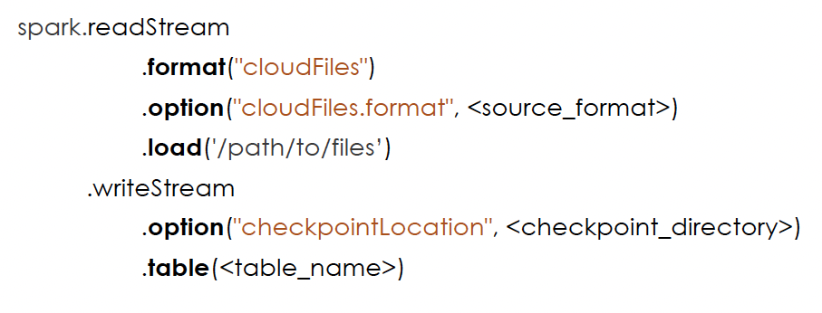 

Da notare che per l'auto loader vi è un formato specifico

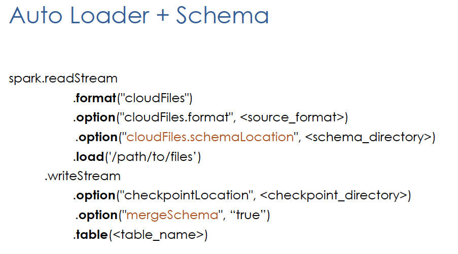 

Così come le CREATE TABLE, è possibile specificare uno schema.

### Run Auto Loader
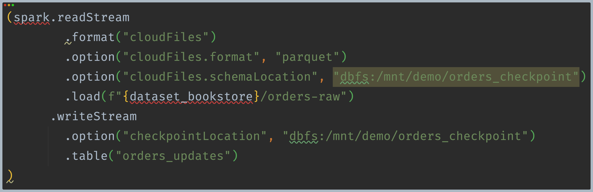

## AUTO LOADER VS COPY INTO
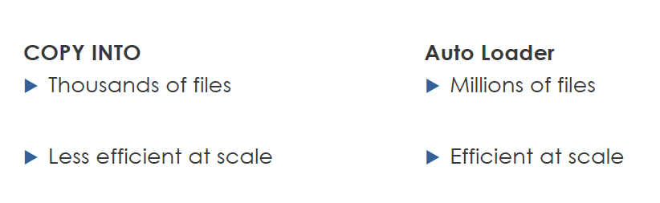 

Auto Loader è sempre preferibile per ambienti CLOUD

---

# Architettura MultiHop
Anche conosciuta come architettura ***MEDALLION***, è un pattern di design usato per organizzare logicamente i dati in modo **multi livello**.

L'obiettivo è quello di *incrementare la qualità e la struttura dei dati ad ogni livello*. Di solito è costituito da almeno tre livelli:
1. **Bronze**: Contiene dati ingestiti da diverse sorgenti senza trasformazioni
2. **Silver**: Contiene view più raffinate dei dati, ad esempio con filtri, trasformazioni o join
3. **Gold**: Contiene aggregazioni a livello business, con report, dashboard ecc...

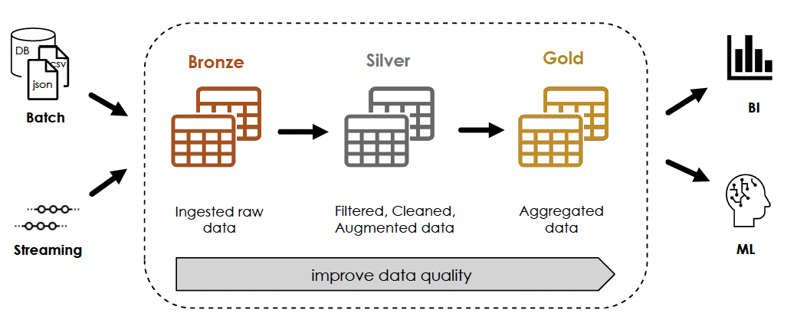

# Delta Live Tables

Delta Live Tables, o **DLT**, è un framework per costruire *pipeline* affidabili e con facile mantenibilità. Queste sono implementante usando i notebooks.

## Esempio DLT


### To Create orders_raw:

```sql
CREATE OR REFRESH STREAMING LIVE TABLE orders_raw  
COMMENT "The raw books orders, ingested from orders-raw"  
AS SELECT * FROM cloud_files("${datasets_path}/orders-json-raw", "json",  
map("cloudFiles.inferColumnTypes", "true"))
```
read from json in cloud


### To refresh customers:

```sql
CREATE OR REFRESH LIVE TABLE customers  
COMMENT "The customers lookup table, ingested from customers-json"  
AS SELECT * FROM json.`${datasets_path}/customers-json`
```

Here we read from json

### To create orders_cleaned:

```sql
CREATE OR REFRESH STREAMING LIVE TABLE orders_cleaned (  
CONSTRAINT valid_order_number EXPECT (order_id IS NOT NULL) ON VIOLATION DROP ROW  
)  
COMMENT "The cleaned books orders with valid order_id"  
AS  
SELECT order_id, quantity, o.customer_id, c.profile:first_name as f_name, c.profile:last_name as l_name,  
cast(from_unixtime(order_timestamp, 'yyyy-MM-dd HH:mm:ss') AS timestamp) order_timestamp, o.books,  
c.profile:address:country as country  
FROM STREAM(LIVE.orders_raw) o  
LEFT JOIN LIVE.customers c  
ON o.customer_id = c.customer_id
```


### To create final cn_daily_customer

```sql
CREATE OR REFRESH LIVE TABLE cn_daily_customer_books  
COMMENT "Daily number of books per customer in China"  
AS  
SELECT customer_id, f_name, l_name, date_trunc("DD", order_timestamp) order_date, sum(quantity) books_counts  
FROM LIVE.orders_cleaned  
WHERE country = "China"  
GROUP BY customer_id, f_name, l_name, date_trunc("DD", order_timestamp)
```

Here we create an aggregation table with sum of book for each country

# Change Data Capture

Esso, detto anche **CDC**, non è altro che il processo di identificazione dei cambiamenti avvenuti sui dati nella sorgente (**SOURCE**), e il propagamento degli stessi nelle destinazioni (**TARGET**)

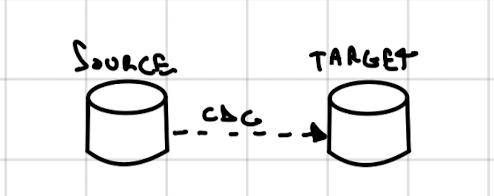

Questo cambio può avvenire a livello di riga per tre motivazioni:
1. Inserimento nuovi record
2. Aggiornamento record già esistenti
3. Eliminazione di record esistenti


Puoi usare CDC in Delta Live Tables per cambiare le tabelle in base ai dati sorgente. CDC python e sql. Delta Live Tables supporta aggiornamenti per tabelle di tipo *slowly changing dimensions* (SCD) tipo 1 e tipo 2:

- Il tipo 1 aggiorna direttamente i record, qui la storia non c'è.
- Il tipo 2 mantiene la storia, gestisce la validità tramite due campi, start e fine

## SCD1 implementazione

**Python**

```python
import dlt
from pyspark.sql.functions import col, expr

@dlt.view
def users():
  return spark.readStream.format("delta").table("cdc_data.users")

dlt.create_streaming_table("target")

dlt.apply_changes(
  target = "target",
  source = "users",
  keys = ["userId"],
  sequence_by = col("sequenceNum"),
  apply_as_deletes = expr("operation = 'DELETE'"),
  apply_as_truncates = expr("operation = 'TRUNCATE'"),
  except_column_list = ["operation", "sequenceNum"],
  stored_as_scd_type = 1
)
```

**sql**
```sql
-- Create and populate the target table.
CREATE OR REFRESH STREAMING TABLE target;

APPLY CHANGES INTO
  live.target
FROM
  stream(cdc_data.users)
KEYS
  (userId)
APPLY AS DELETE WHEN
  operation = "DELETE"
APPLY AS TRUNCATE WHEN
  operation = "TRUNCATE"
SEQUENCE BY
  sequenceNum
COLUMNS * EXCEPT
  (operation, sequenceNum)
STORED AS
  SCD TYPE 1;
```


## SCD2 implementazione

**Python**

```python
import dlt
from pyspark.sql.functions import col, expr

@dlt.view
def users():
  return spark.readStream.format("delta").table("cdc_data.users")

dlt.create_streaming_table("target")

dlt.apply_changes(
  target = "target",
  source = "users",
  keys = ["userId"],
  sequence_by = col("sequenceNum"),
  apply_as_deletes = expr("operation = 'DELETE'"),
  except_column_list = ["operation", "sequenceNum"],
  stored_as_scd_type = "2"
)
```

**SQL**
```sql
-- Create and populate the target table.
CREATE OR REFRESH STREAMING TABLE target;

APPLY CHANGES INTO
  live.target
FROM
  stream(cdc_data.users)
KEYS
  (userId)
APPLY AS DELETE WHEN
  operation = "DELETE"
SEQUENCE BY
  sequenceNum
COLUMNS * EXCEPT
  (operation, sequenceNum)
STORED AS
  SCD TYPE 2;
```

## Feed di CDC

I cambiamenti vengono registrati come eventi che contengono sia i dati che i relativi metadata. Possono avvenire sia tramite streaming che tramite un json.

Feed con update:

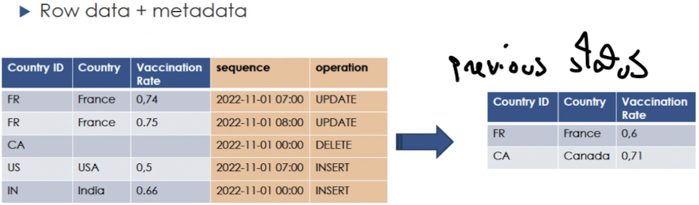

Tabella target una volta elaborato il feed:

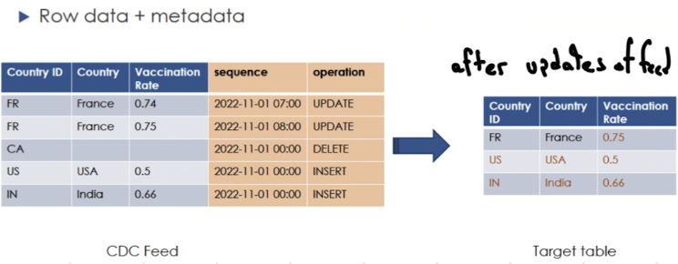

## Pro e Contro

**PRO**

- Si ordinano gli arrivi tramite la sequence key, permettendo anche le rielaborazioni
- Si assume di default che che le righe siano di update o insert
- In base ad una condizione si può applicare il delete
- Si possono specificare le chiavi primarie
- Si possono selezionare solo specifiche colonne
- Supporta SCD1 e SCD2

**CONTRO**
- Rompe il requirements di only append per lo streaming, non permettendo l'esecuzione di query streamings sulla tabella target

# Job

Tramite l'utilizzo dei job è possibile eseguire diverse azioni, pipeline definendo dipendenze tra le stesse. Vi è anche la possibilità di schedulare. Funzionano come orchestrator.

# Databricks SQL

Esso è un DWH che permette di eseguire Query e Job in modo scalabile, con una sola data governance. SQL Warehouse è l'esecutore di databricks SQL, è un engine basato su un cluster SPARK.


# Data Governance

Permette di rimuovere, dare o negare permessi direttamente da SQL per un oggetto in databricks.

```sql 
<operation> <privilege> ON <object-type> <object-name> TO <user or group>
```

Possibili ***operation***:
- *GRANT*
- *DENY*
- *REVOKE*
- *SHOW GRANTS*

Possibili ***privilege***:
- *SELECT*: accesso lettura
- *MODIFY*: add, delete, modify dati
- *CREATE*: creare un oggetto
- *READ_METADATA*: visualizzare info su un oggetto e i suoi metadata
- *USAGE*: necessario per usare un oggetto Database
- *ALL_PRIVILEGES*: tutti quelli precedenti

Possibili ***oggetti***
- *CATALOG*: accesso all'intero catalog
- *SCHEMA*: accesso al database
- *TABLE*: accesso ad una tabella
- *VIEW*: accesso ad una view
- *FUNCTION*: accesso ad una named function
- *ANY FILE*: accesso ad un path filesystem

Ruoli che possono dare permessi:

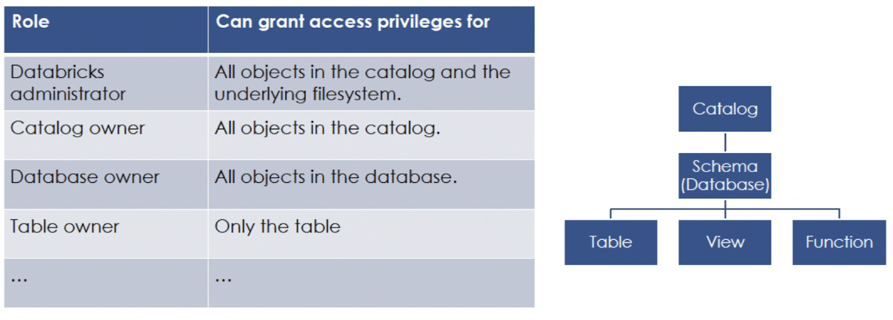

## Unity Catalog

Non è altro che il modello di data governance usato da Databricks. Si tratta di una soluzione centralizzata di governance che permette di gestire tutti i workspace, cloud ed avere il controllo completo su tutti i tipi di dati, oggetti ed Asset AI da un unico punto.


In precedenza ogni workspace aveva la propria data governance, con unity catalog vi è un livello superiore che permette di gestire tutto.

### Identità nell Unity Catalog

Vi sono:

- **Users**: identificati da mail
- **Service Principle**: Identificati da application IDs
- **Groups**: gruppi di Users e/o Service Priciple
	- Possono essere nested


### Recap

Lo unity catalog fornisce:
1. Governance Centralizzata
2. Ricerca di dati integrato
3. Lineage automatizzata
4. Nessuno sforzo nelle migrazioni

# Modeling Data Management Solutions

## Bronze Ingestion Patterns

Nel momento di alimentazione delle bronze table vi sono due alternative:
- **SINGLEPLEX**: per ogni dataset di input vi è una tabella nel *bronze layer*. Ideale per use case batch
- **MULTIPLEX**: più dataset mappati su una singola tabella, ideale per casi streaming, in cui è preferibile splittare i record in un secondo momento.

| Type                    | Example                                                                                                |
| ----------------------- | ------------------------------------------------------------------------------------------------------ |
| SINGLEPLEX TABLE        | 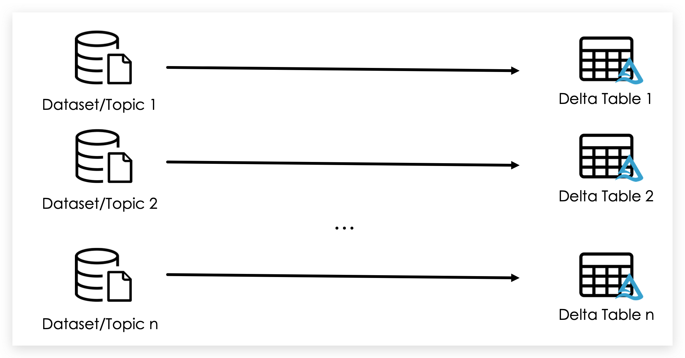   |
| SINGLEPLEX DATA EXAMPLE | 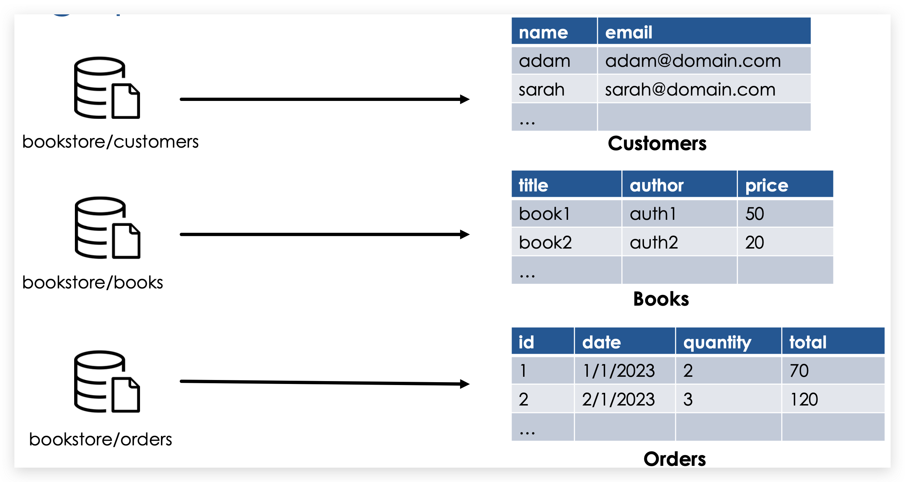   |
| MULTIPLEX TABLE         | 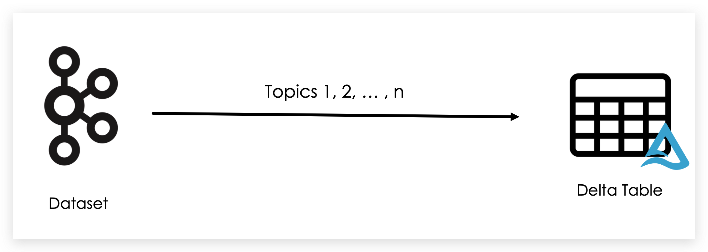 |
| MULTIPLEX DATA EXAMPLE  | 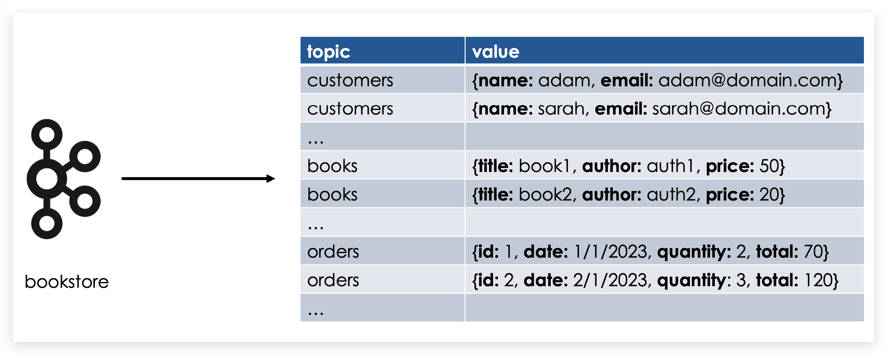  |
|                         |                                                                                                        |

Esempi di implementazione: [code](https://github.com/derar-alhussein/Databricks-Certified-Data-Engineer-Professional/blob/7c91ff4d8a844b321e86c46efe419fd67f157046/2%20-%20Data%20Modeling/2.1%20-%20Multiplex%20Bronze.py#L22-L22)
Esempi di implementazione streaming multiplex bronze: [code](https://github.com/derar-alhussein/Databricks-Certified-Data-Engineer-Professional/blob/7c91ff4d8a844b321e86c46efe419fd67f157046/2%20-%20Data%20Modeling/2.2%20-%20Streaming%20from%20Multiplex%20Bronze.py#L13-L13)
Esempi di aggiunta di check sulla qualita: [code](https://github.com/derar-alhussein/Databricks-Certified-Data-Engineer-Professional/blob/7c91ff4d8a844b321e86c46efe419fd67f157046/2%20-%20Data%20Modeling/2.3%20-%20Quality%20Enforcement.py)
Esempi di rimozione duplicati da streaming: [code](https://github.com/derar-alhussein/Databricks-Certified-Data-Engineer-Professional/blob/7c91ff4d8a844b321e86c46efe419fd67f157046/2%20-%20Data%20Modeling/2.4%20-%20Streaming%20Deduplication.py)

## Slowly Changing Dimensions
Sono concetti di data management che determinano come le tabelle gestiscono l'evoluzione dei dati ne tempo. Si può ad esempio decidere se gestire una *storia* o no.

Vi sono 3 tipi:
- **Type 0:** Non sono ammessi cambiamenti, sono tabelle statiche o tabelle aggiornate solo in **append**.
- **Type 1:** Non c'è gestione della storia, si va solo in **overwrite**.
- **Type 3:** Viene gestita la storia, viene aggiunto un record per ogni cambiamento marchiando il record precedente come obsoleto.

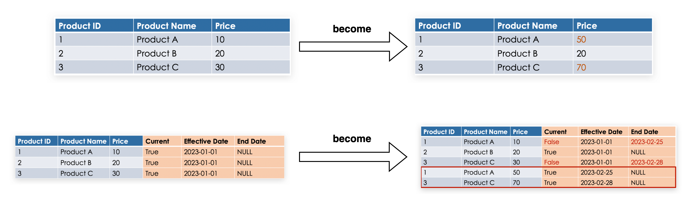
**NB:** Si può pensare di avere lo stesso risultato delle SCD2 utilizzando Delta Time Travel fornito da Databricks, ma questo non è possibile in quanto il DTT ha un tempo prefissato, oltre che è soggetto all'uso di comandi di pulizia come VACUUM.

Esempio di implementazione scd: [code](https://github.com/derar-alhussein/Databricks-Certified-Data-Engineer-Professional/blob/7c91ff4d8a844b321e86c46efe419fd67f157046/2%20-%20Data%20Modeling/2.5%20-%20Type%202%20SCD.py#L11-L11)
# Data Processing
## Change Data Capture
Si tratta del processo di intercettazione dei cambiamenti all'interno della sorgente per poi trasmetterli alla destinazione, che si tratti di INSERT, UPDATE o DELETE.
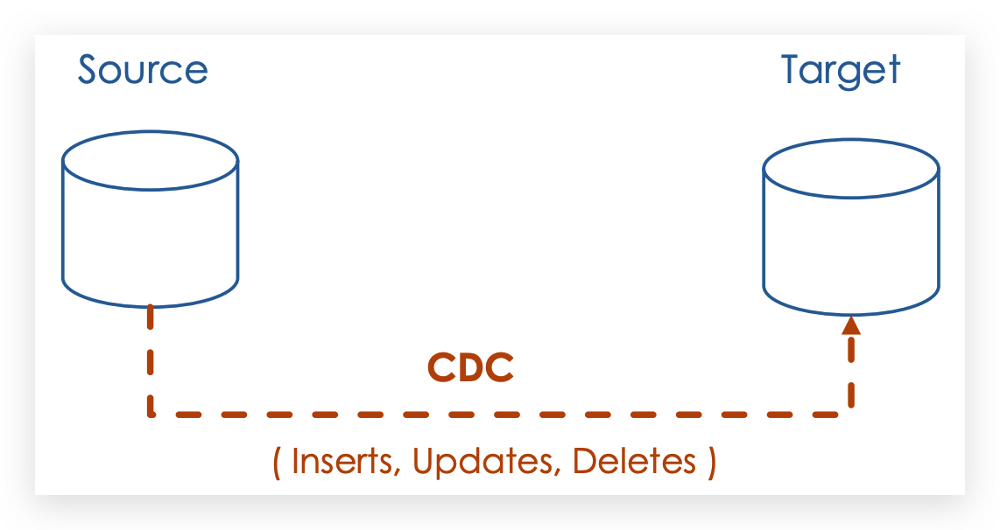

I cambiamenti vengono inviati tramite un file di log chiamato **CDC feed**, dove vengono inviati sia i dati che i metadata conteneti info sui cambiamenti avvenuti. Questo log può essere ricevuto sia via stream di dati che json. Esso viene gestito tramite l'uso del merge in sql. Unico problema è che questo non può essere utilizzato se vi sono più update per la stessa chiave. Una soluzione può essere quella di usare una row function per ordinare gli update ed utilizzare solo il più recente.

Esempio implementazione qui: [code](https://github.com/derar-alhussein/Databricks-Certified-Data-Engineer-Professional/blob/7c91ff4d8a844b321e86c46efe419fd67f157046/3%20-%20Data%20Processing/3.1%20-%20Change%20Data%20Capture.py#L13-L13)

## Delta Lake CDF

Change Data Feed è una feature di Databricks per Deltalake che permette di creare automaticamente i CDC Feed per una DeltaLake table. Esso registra tutti i cambiamenti di una tabella a livello di riga. Essi vengono usati per propagare i cambiamenti ai vari livelli dell'architettura. i vari CDF possono essere interrogati tramite funzione sql **table_changes**. Esso può essere indicato alla creazione della tabella o può essere aggiunto in seguito tramite un comando di alter tramite la proprietà **delta.enableChangeDataFeed = true**. Può essere anche settato a spark per la creazoine delle tabelle tramite la conf **spark.databricks.delta.properties.defaults.enableChangeDataFeed**. Essi seguiranno Comunque la retention settata per la tabella e sarà soggetto al comando di Vacuum.

Esempio implementazione qui: [code](https://github.com/derar-alhussein/Databricks-Certified-Data-Engineer-Professional/blob/7c91ff4d8a844b321e86c46efe419fd67f157046/3%20-%20Data%20Processing/3.2-%20CDF.py#L24-L24)

## Stream Joins

Esempio implementazione join tra due stream: [code](https://github.com/derar-alhussein/Databricks-Certified-Data-Engineer-Professional/blob/7c91ff4d8a844b321e86c46efe419fd67f157046/3%20-%20Data%20Processing/3.2-%20CDF.py#L24-L24)

In caso di tabelle streaming esse sono sempre append ma per quanto riguarda le batch esse possono essere aggiornate o sovrascritte spezzando il requisito di solo append dello structured streaming. Per ovviare questo problema il join tra una tabella streaming ed una batch verrà considerata come tabella driver quella streaming, mentre per un aggiornamento della batch dovrà essere effettuata una implementazione batch a parte.

Esempio implementazione qui: [code](https://github.com/derar-alhussein/Databricks-Certified-Data-Engineer-Professional/blob/7c91ff4d8a844b321e86c46efe419fd67f157046/3%20-%20Data%20Processing/3.4%20-%20Stream-Static%20Join.py)

## Esempio Implementazione Gold

[code](https://github.com/derar-alhussein/Databricks-Certified-Data-Engineer-Professional/blob/7c91ff4d8a844b321e86c46efe419fd67f157046/3%20-%20Data%20Processing/3.5%20-%20Materialized%20Gold%20Tables.py#L24-L24)

# Improving Performance

## Partitioning Delta Lake Tables
Una partizione non è altro che un set di dati che condivide per una specifica colonna prestabilita lo stesso valore. Esse verranno contenute in una cartella specifica del filesystem, una per ogni valore della colonna di partizione. Questo permetterà al momento dell'esecuzione di una query dove è specificato il valore di una partizione di effettuare una scan solo su quella cartella. Le regole da seguire per la scelta della colonna di partizione sono le seguenti:
- Usare colonne con cardinalità di valori bassa
- Evitare partizioni con dimensioni minori di 1 GB
- Per tabelle streaming è sempre preferibile utilizzare colonne DATETIME
- Evitare over-partitioning in quanto aumenta i costi ed il numero di file.

Esempio di codice qui: [code](https://github.com/derar-alhussein/Databricks-Certified-Data-Engineer-Professional/blob/7c91ff4d8a844b321e86c46efe419fd67f157046/4%20-%20Improving%20Performance/4.1%20-%20Partitioning%20Delta%20Lake%20Tables.py)

## Delta Lake Transaction Log

Esso consiste nella creazione di un file json ogni qualvolta avviene una modifica su una tabella. Questi file verranno salvati sotto la folder *delta_log* (all'interno della folder della tabella). Ogni volta che vengono generati 10 file DB creerà un file parquet di checkpoint. Il transaction log contiene anche le statistiche per ogni file aggiunto (**Delta Lake File Statistics**). Queste statistiche indicano per il file:
- Totale numero dei record
- Statistiche sulle prime 32 colonne
	- valore minimo
	- valore massimo
	- numero di valori null
Esso permetterà di effettuare lo **data skipping**. Per queste colonne è preferibile evitare le stringhe con cardinalità alta (ad esempio codice_fiscale)

I file di log non vengono cancellati dal comando VACUUM, ma databricks effettuerà clean dei log dopo un tempo prestabilito (default 30 giorni) che è possibile configurare tramite il comando **delta.logRetentionDuration**

Esempio utilizzo qui: [code](https://github.com/derar-alhussein/Databricks-Certified-Data-Engineer-Professional/blob/7c91ff4d8a844b321e86c46efe419fd67f157046/4%20-%20Improving%20Performance/4.2%20-%20Delta%20Lake%20Transaction%20Log.py)

## Auto Optimize
Oltre al comando **Optimize** che può essere usato per compattare più file, databricks mette a disposizione l'auto optimize. Esso si occupa di compattare in modo automatico i file durante le write.
Ha due funzioni complementari:
1. Cerca di scrivere file di 128 mb
2. Dopo la scrittura verifica se è possibile compattare ulteriormente, se si lancia un comando optimize impostando la dimensione a 128 (invece di 1 gb)
Auto compaction non supporta Z-ordering in quanto è molto costoso rispetto alla compattazione. Anche l'auto optimize può essere settato sia in fase di creazione che di alter di una tabella, la proprietà sono le seguenti:
- **delta.autoOptimize.optimizeWrite=true**
- **delta.autoOptimize.autoCompact=true**
Può essere settato anche tramite spark tramite le conf:
- **spark.databricks.delta.optimizeWrite.enabled**
- **spark.databricks.delta.autoCompact.enabled**

# DataBricks Tooling

## Jobs
Tramite la sezione workflow messa a disposizione da Databricks è possibile gestire tutte le configurazioni, quelle relative al cluster, delle politiche di retry, di concorrenza, della sorgente del codice e altro. Vi è anche la possibilità di costruire il DAG del job tramite UI aggiungendo i vari task e le dipendenze tra loro. Inoltre è possibile fare un troubleshooting accurato dello stesso.

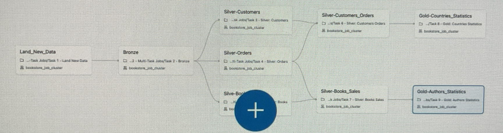

Tutti gli esempi di implementazione qui: [code](https://github.com/derar-alhussein/Databricks-Certified-Data-Engineer-Professional/tree/7c91ff4d8a844b321e86c46efe419fd67f157046/5%20-%20Databricks%20Tooling)

## Rest Api
La documentazione sull'utizzo delle api databricks è disponibile qui: [api](https://docs.databricks.com/api/workspace/introduction)
## Databrikcs CLI 
La documentazione sulla command line databricks è disponibile qui: [documentation](https://docs.databricks.com/aws/en/dev-tools/cli)

# Security And Governance
## Propagating Deletes 
Esempio qui: [code](https://github.com/derar-alhussein/Databricks-Certified-Data-Engineer-Professional/blob/7c91ff4d8a844b321e86c46efe419fd67f157046/6%20-%20Security%20and%20Governance/6.1%20-%20Propagating%20Deletes.py)

## Dynamic Views
Esempio qui: [code](https://github.com/derar-alhussein/Databricks-Certified-Data-Engineer-Professional/blob/7c91ff4d8a844b321e86c46efe419fd67f157046/6%20-%20Security%20and%20Governance/6.2%20-%20Dynamic%20Views.py)

# Testing And Deployment
Il comando **%run** permette di eseguire un'altro notebook da quello corrente. Dunque è possibile creare file arbitrari come ad esempio py ed importarli come si farebbe normalmente in python. Il comando **%sh** esegue bash mentre **%sql** codice sql.

## Data Pipeline Testing
In Databricks vi sono 2 tipi di test che possono essere effettuati su una pipeline: **quality** e **standard**.
### Data Quality Test
Sono usati per verificare la qualità dei dati, check sui constraints delle delta tables ad esempio.
### Standard Test
Si occupano di verificare la logica della pipeline. Vengono eseguiti ogni qualvolta viene modificata la stessa. Vi sono tre tipi:
- **Unit Test:** Vengono usati per testare individualmente pezzi di codice, come ad esempio delle funzioni. Vengono verificate tramite assertion
- **Integration Test:** Testano se i moduli del software sono integrati logicamente e funzionano come gruppo
- **End to end:** Verifica se la pipeline viene propriamente eseguita in un caso reale, simulando un esecuzione dall'inizio alla fine e verificandone l'esito.
# Monitoring And Logging
## Permessi
Si possono configurare due tipi di permessi nel cluster. Il primo è accessibile dall'admin console. Da qui si può dare a user o gruppi la possibilità di creare cluster. Il secondo è accessibile dal tab compute, dove è possibile modificare e gestire gli utenti ed i permessi che hanno su ogni singolo cluster:
- **can manage**, tutti i permessi
- **can restart**, avviare, stoppare e riavviare un cluster
- **can attach**, utlizzare il cluster tramite notebook e vedere i logs
## Logs
Databricks mette a disposione diversi tool per i log relativi alle attività del cluster:
- **EVENT LOGS**: mostra eventi importanti sul ciclo di vita di un cluster. Ogni evento può essere filtrato e vi è un log json che mostra le differenze tra prima e dopo.
- **DRIVER LOGS**: vi sono tutti i log delle applicazioni e/o dei notebooks in esecuzione sul cluster. Abbiamo i classici STDOUT, STDERR, STDWAR e LOG4J logs.
- **METRICS LOGS**: dove è possibile monnitorare le performance del cluster anche tramite l'ausilio di **GANGLIA UI**, un interfaccia che permette un semplice consulto. Vi sono 4 grafici sostanziali su: memoria, cpu, network e load.

I logs sono visibili per ogni nodo.

---
**Obsidian tags:** #databricks #BigData #deltalake