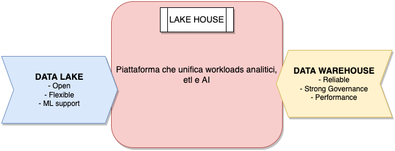
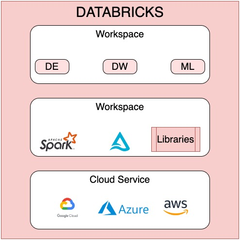
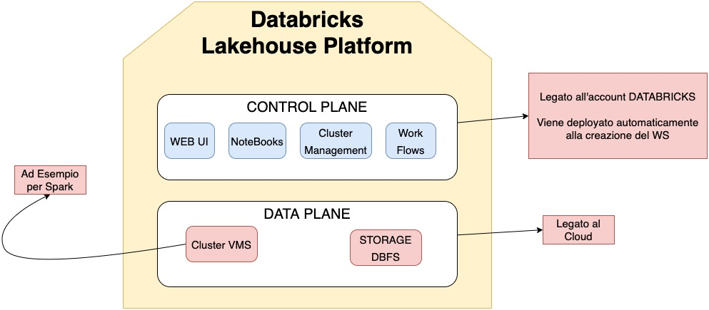
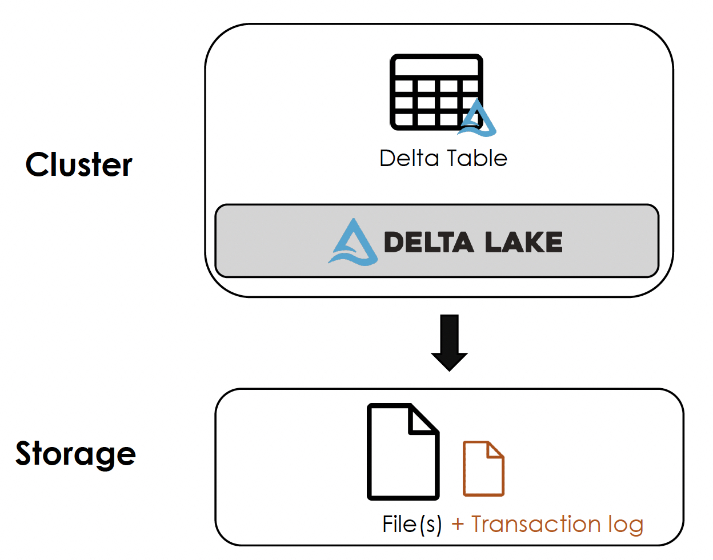
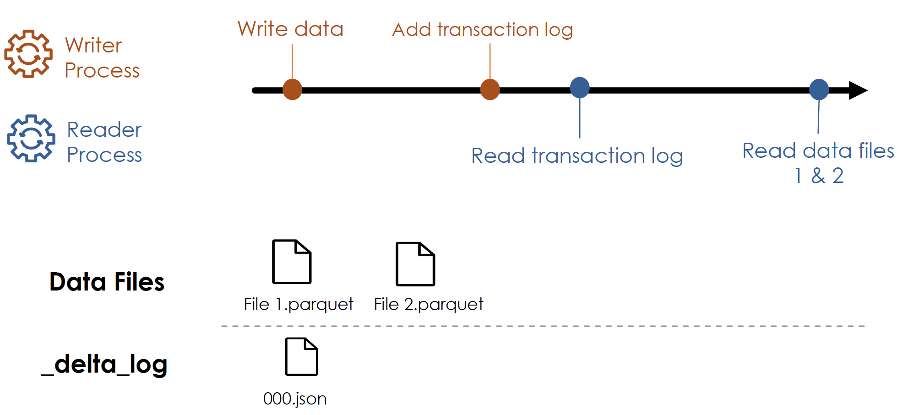
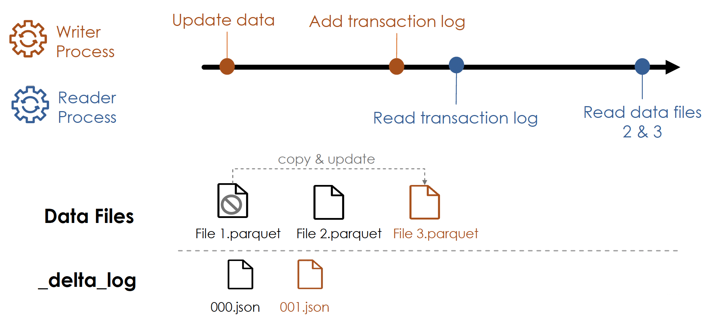
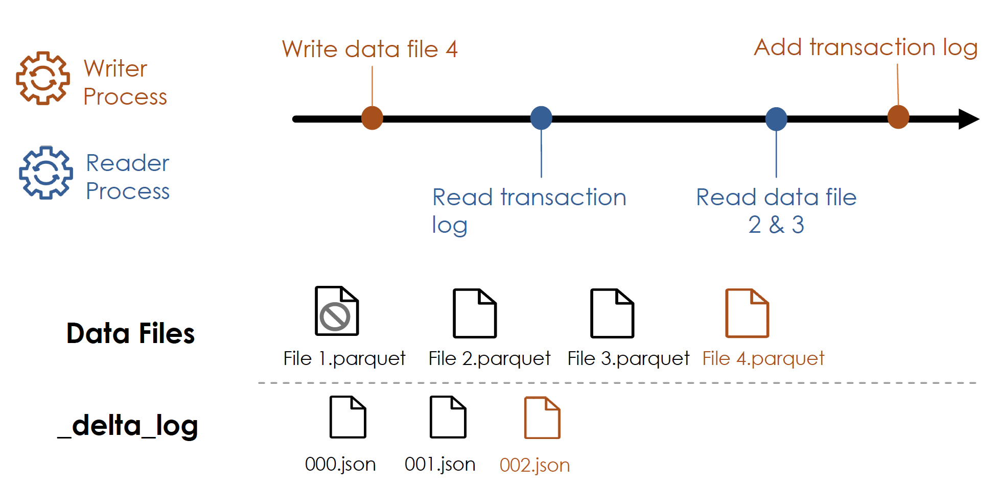
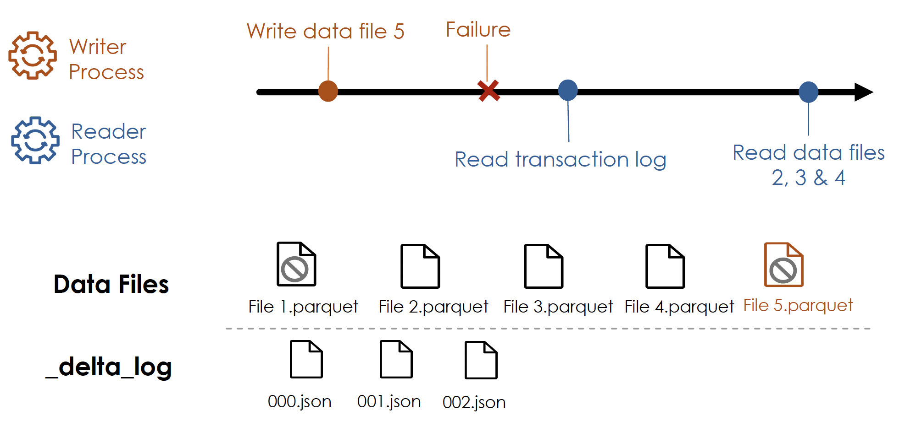
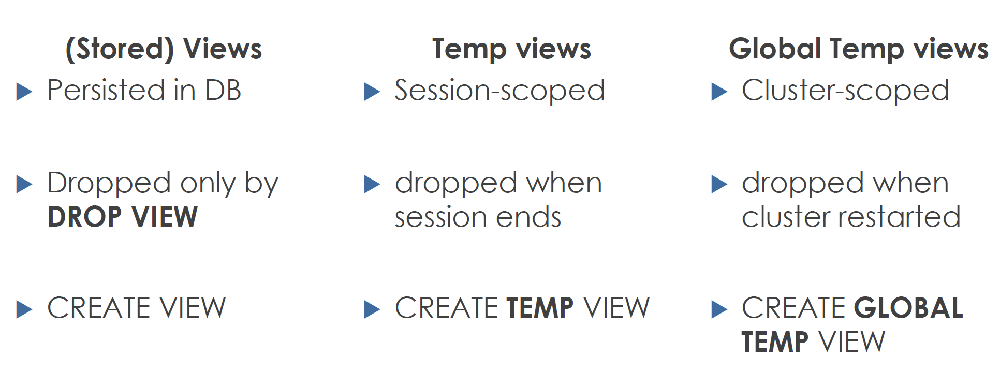

# Introduction

Databrics è una piattaforma **LAKEHOSE** multicloud, basata su [Apache Spark](https://spark.apache.org/).


Per Lakehouse si intende un ibrido tra un Data Lake ed un Data Warehouse. Esso infatti è una piattaforma analitica che combina i migliori pregi di un Data Lake e di un Data Warehouse fornendo una singola piattaforma con i vantaggi di entrambi




# Architettura Databricks

L'architettura di un Lake House si divide in tre livelli fondamentali:
- Cloud Service
- Runtime
- Workspace

Il **Cloud Service** è gestito da un provider esterno, i più famosi sono: AWS, GCP e AZURE.
Il **Runtime** è l'insieme dei componenti del core:
- Spark
- Delta lake
- Altre librerie

Il **workspace** è l'ambiente che permette di interagire interattivamente tramite workloads.



# Come sono deployate?

Vi sono due componenti di alto livello in Databricks:
- **CONTROL PLANE**
- **DATA PLANE**.

Il primo è legato all'account Databricks mentre il secondo è legato alla sottoscrizione cloud.



## Spark su Databricks
Essendo sviluppato dallo stesso team di Spark, databricks supporta tutte le funzioni di SPARK:
- In memory distributed data processing
- Tutti i linguaggi supportati da spark:
	- python
	- scala
	- java
	- sql
	- R
- Batch e Streaming
- Dati strutturati, semi e non strutturati
## Databricks File System
Databricks mette a disposizione il suo [DFS](./../UsefulGeneralNotes/DistributedFileSystem.md). Esso viene preinstallato e prende il nome di  **DBFS**. In realtà non è un vero e proprio DFS, ma è un layer di astrazione, esso usa infatti lo storage messo a disposizione dal cloud scelto per memorizzare i dati, ma fornisce all'interno della piattaforma una interfaccia unica.

# Delta Lake
Delta Lake è un framework di storage open source che permette a Databricks di essere affidabile. I Data Lakes hanno però alcune limitazioni quali l'inconsistenza e performance. 

Delta Lake si pone come obiettivo quello di rimediare a questi problemi. Esso è:
- Open Source => no proprietari
- Storage Framework Layer => Non c'è un formato prefissato
- Permette di creare LakeHouse => Nessun DB o DW

Il componente Delta Lake viene deployato automaticamente sul cluster come parte del runtime di Databricks. 
Quando viene creata una tabella DeltaLake essa può essere salvata in storage tramite uno o più file **PARQUET**. Insieme a questo file viene creato un file fondamentale, il *Transaction Log*.



## Transaction Log

Il transaction log, o **Delta Log**, si occupa di tenere traccia dei cambiamenti dei dati. Ordina i records di ogni transazione eseguita sulla tabella e viene considerato come **SINGOLA SORGENTE DI VERITA**. Esso viene usato per ricavare l'ultima versione dei dati da servizi quali Spark o notebooks. Ogni transazione è committata tramite un Json file contenente informazione su:
- operazione effettuata + **Predicate** (operazione e filtri)
- file dei dati annessi alla transizione

Il transaction log permette di leggere sempre l'ultima versione del file, evita dead lock e letture sporche.

### Operazioni

#### Lettura e Scrittura

#### Update

#### Lettura e Scrittura simultanea

#### Scrittura fallita


### Vantaggi Transaction Log
Il delta log permette a delta lake di:
- Rispettare i principi [ACID](https://it.wikiversity.org/wiki/Propriet%C3%A0_ACID) in un object storage
- Avere dei metadata scalabili
- Avere uno storico completo di tutti i cambiamenti
- Costruito su un data format standard: Parquet e Json

## Time Travel
Come spiegato Delta Log dà la possibilità di tenere uno storico completo delle modifiche. Vi è la possibilità di interrogare i dati in un preciso momento, utilizzando il **version number** o un **timestamp**.

Tramite timestamp:
```
SELECT * FROM mytable TIMESTAMP AS OF "2020-01-01"
```

Tramite version number:
```
SELECT * FROM mytable VERSION AS OF 17
```
oppure
```
SELECT * FROM mytable@v17
```


In questo modo è possibile effettuare un rollback in caso di necessità direttamente alla versione desiderata:
```sql
RESTORE TABLE mytable AS [version_number|timestamp]
```

Per visionare la storia della tabella:
```
DESCRIBE HISTORY mytable
```

Per visionare la storia della tabella:


## Compaction
Delta Lake fornisce il comando **optimize**. Esso permette di compattare i file aumentando le performance della tabella. Si può specificare un **zorder**, un parametro che permette di raggruppare nello stesso file i dati simili. (CONCETTO DI BUCKETING)

```
OPTIMIZE mytable
```

## Vacuum
Il comando **vacuum** permette di effettuare pulizia dei dati, rimuovendo magari i file non più utilizzati o committati.
Questo comando può essere usato per recuperare molto spazio. Il comando prende un input la **RETENTION**, ovvero il periodo dei dati che **deve** essere mantenuto. Il valore di default è 7 giorni.

```
VACUUM mytable [retention period]
```

Una volta utilizzato Vacuum ovviamente non è più possibile effettuare time travel precedenti al periodo di retention.

# Relation Entities
La gestione dei database e della tabella è uguale a quella di [Hive](./../Apache/Hive.md). L'unica differenza è che abbiamo i delta log.

## Tabelle
### Set up tabelle
Una tabella può essere creata con:
- create statement
- create da risultato di query (**CTAS**)
Nel secondo caso lo schema viene inferito automaticamente, non può essere passato manualmente. Possono essere specificati:
- COMMENT
- PARTITIONED BY
- LOCATION
### Table Contraints
Databricks supporta due tipi di contraints:
- NOT NULL
- CHECK
### Cloning
Esistono due tipi di clonazione:
- **Deep Cloning**: copia sia i dati che i metadata di una tabella.
- **Shallow Clone**: copia solo i delta logs.

Nessuno dei due ha effetti sulla tabella sorgente.

## Views
Non è altro che una tabella virtuale che non ha dati fisici, una query eseguita ogni qualvolta viene richiamata.
```
CREATE VIEW my_view AS SELECT * FROM my_table
```
Vi sono:
- Stored views: oggetti persistiti =>  ```sql CREATE VIEW view_name AS query```
- Temporary views: vivono nella specifica sessione => ```sql CREATE TEMP VIEW view_name AS query```
- Global temporary views: legato alla vita del cluster, ogni componente dello stesso può usufruirne => ```sql CREATE GLOBAL TEMP VIEW view_name AS query```

### Versus



---
**Obsidian tags:** #databricks #BigData #deltalake