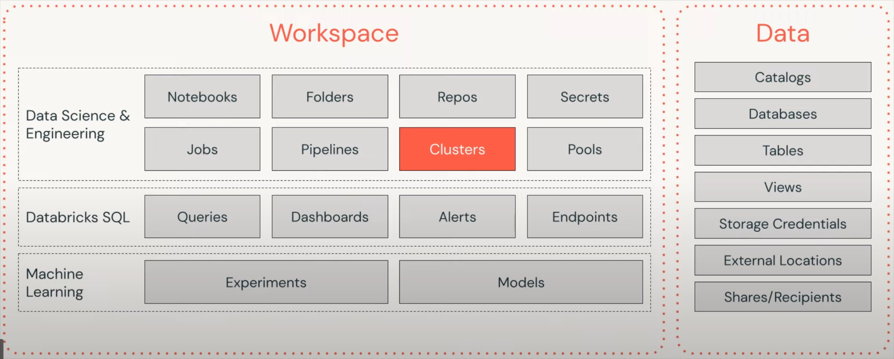

The Databricks Lakehouse Platform has created a paradigm shift by unifying data and AI on a single, open platform.

Databricks is an enterprise software company that provides Data Engineering tools for **Processing** and **Transforming** huge volumes of data to build machine learning models. Traditional Big Data processes are not only sluggish to accomplish tasks but also consume more time to set up clusters using Hadoop. However, Databricks is built on top of distributed Cloud computing environments like **Azure, AWS, or Google Cloud** that facilitate running applications on CPUs or GPUs based on analysis requirements.

[Databricks](https://databricks.com/) is a Web-based platform, which is also a **one-stop product** for all Data requirements, like Storage and Analysis. It can derive insights using SparkSQL, provide active connections to visualization tools and build Predictive Models using **SparkML**. Databricks also can create interactive **displays, text,** and **code** tangibly.
Databricks is integrated with **Microsoft Azure, Amazon Web Services,** and **Google Cloud Platform**.

Databricks simplifies Big Data Analytics by incorporating a **LakeHouse architecture** that provides **data warehousing capabilities** to **a data lake**. As a result, it eliminates unwanted data silos created while pushing data into data lakes or multiple data warehouses. It also provides data teams with a **single source of the data** by leveraging LakeHouse architecture.

Databricks **unify** your data ecosystem with open source standards and format

## Databricks Architecture

Databricks is the application of the **Data Lakehouse** concept in a unified cloud-based platform. Databricks is positioned above the existing data lake and can be connected with cloud-based storage platforms like Google Cloud Storage and AWS S3. Understanding the architecture of databricks will provide a better picture of What is Databricks.

### Layers of Databricks Architecture

-   **Delta Lake:** Delta Lake is a Storage Layer that helps Data Lakes be more reliable. Delta Lake integrates streaming and batch data processing while providing ACID (Atomicity, Consistency, Isolation, and Durability) transactions and scalable metadata handling. Furthermore, it is fully compatible with Apache Spark APIs and runs on top of your existing data lake.
	- Strengths: 
		- Store any kind of data
		- Inexpensive storage
		- Good Starting point
	- downsides: 
		- Complex to set up
		- Poor BI performance
		- Can become unreliable data swamps
-   **Delta Engine:** The Delta Engine is a query engine that is optimized for efficiently processing data stored in the Delta Lake.
-   It also has other inbuilt tools that support Data Science, BI Reporting, and MLOps.

All these components are integrated as one and can be accessed from a single ‘**Workspace**’ user interface (UI). This UI can also be hosted on the cloud of your choice.
#### Workspace
An **Interactive Analytics platform** that enables Data Engineers, Data Scientists, and Businesses to collaborate and work closely on notebooks, experiments, models, data, libraries, and jobs.
#### Assets

#### Workflow

### Databricks Lakehouse
 
It is:
- **Simple**: Unify your data warehousing and AI use case on a single platform
- **Open**: Built on open source and open standards
- **Multicloud**: You can choose any cloud platform
#### Benefits
- ACID transactions
- Schema enforcement
- Governance support
- Direct access to source data
- Fully scalable
- Open formats
- Structured, unstructured or semi-structured data
- Real-time data collection and reporting

### Databricks Machine Learning

An integrated **end-to-end Machine Learning** environment that incorporates managed services for experiment tracking, feature development and management, model training, and model serving. With **Databricks ML, you can train Models manually or with AutoML, track training parameters** and **Models** using experiments with **MLflow tracking,** and create feature tables and access them for Model training and inference.

You can now use **Databricks Workspace** to gain access to a variety of assets such as **Models, Clusters, Jobs, Notebooks, and more.**

### Databricks SQL Analytics

A simple interface with which users can create a **Multi-Cloud** **Lakehouse** structure and perform SQL and BI workloads on a Data Lake. In terms of pricing and performance, this **Lakehouse Architecture** is 9x better compared to the traditional Cloud Data Warehouses. It provides a SQL-native workspace for users to run performance-optimized SQL queries. Databricks SQL Analytics also enables users to create Dashboards, Advanced Visualizations, and Alerts. Users can connect it to **BI tools** such as Tableau and Power BI to allow maximum performance and greater collaboration.

### Databricks Integrations

As a part of the question What is Databricks, let us also understand the Databricks integration. Databricks integrates with a wide range of developer tools, data sources, and partner solutions. 

-   **Data Sources:** Databricks can read and write data from/to various data formats such a**s** Delta Lake, CSV, JSON, XML, Parquet, and others, along with data storage providers such as Google BigQuery, Amazon S3, Snowflake, and others.
-   **Developer Tools:** Databricks supports various tools such as **IntelliJ, DataGrip, PyCharm, Visual Studio Code, and others.**
-   **Partner Solutions:** Databricks has validated integrations with third-party solutions such as **Power BI, Tableau,** and **others** to enable scenarios such as **Data Preparation** and **Transformation, Data Ingestion, Business Intelligence (BI),** and **Machine Learning**.

### Databricks SQL
Databricks SQL (DB SQL) is a serverless data warehouse on the Databricks Lakehouse Platform that lets you run all your SQL and BI applications at scale with up to 12x better price/performance, a unified governance model, open formats and APIs, and your tools of choice – no lock-in.

### Databricks Machine Learning
#### Flow

#### Flow components

#### Architecture

### Databricks Workload

## Link
https://www.databricks.com/learn/training/lakehouse-fundamentals-accreditation#videocomp
---

**Obsidian tags:** #databricks #BigData #deltalake