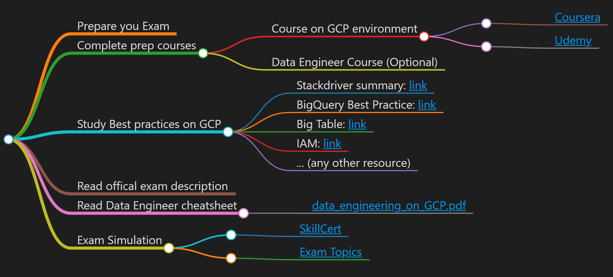

# Prepare you Exam
This page is for guidelines to follow to prepare for Google Cloud Data Engineering certification.

---

## Canvas

---

# Complete prep courses

The first thing to do in order to take the exam is to follow and complete some preparatory courses.

---

## Course on GCP environment

You can find this course on COURSERA
- [Coursera](https://www.coursera.org/professional-certificates/gcp-data-engineering)

A possible other course on Udemy about GCP Professional is available on udemy: 
- [Udemy](https://www.udemy.com/course/google-cloud-gcp-professional-data-engineer-certification/)

If the courses are no longer presents it is recommended to visit the official page for the google exam to see the recommended courses.

**At least one of the courses is strongly recommended unless you already have experience with the environment**.

---

## Data Engineer Course (Optional)

Coursera won't prepare you for everything, but it's a good start, and as mentioned it covers almost half of the exam topics.

The [Data Engineer course](https://linuxacademy.com/google-cloud-platform/training/course/name/google-cloud-data-engineer) on Linux Academy takes it a step further as it talks about Dataprep, a topic more absent on Coursera. What's more, the course is exam-oriented, which might come very helpful when preparing for the exam.

This course (or a similar one) is **required** if you have no experience in data engineering.

--- 

# Study Best practices on GCP

The exam contains lots of questions about the type of service to use and how to set it properly. That is why the focus should be on all possible solutions and how they can be combined with other services, not just on Data Engineering.

Here are some documentation pages you might find helpful:

- Stackdriver summary: [link](https://thenewstack.io/closer-look-google-stackdriver/)
- BigQuery Best Practice: [link](https://cloud.google.com/bigquery/docs/best-practices-costs)
- Big Table: [link](https://cloud.google.com/bigtable/docs/performance)
- IAM: [link](https://cloud.google.com/iam/docs/concepts)
- ... (any other resource)

You can find information about all google services in the official documentation.

--- 

# Read offical exam description

It is **strongly** recommended going through the 
- [exam description](https://cloud.google.com/certification/data-engineer) 

on Google Cloud's page before taking the test. There are two case studies. Read them and proceed with the practice exam to test your knowledge and readiness.

--- 

# Read Data Engineer cheatsheet

This is a great final summary of everything. It can be used for a general review or to identify any gaps.

[data_engineering_on_GCP.pdf](./data_engineering_on_GCP.pdf)

--- 

# Exam Simulation

You can buy exam simulation on 
- [SkillCert](https://skillcertpro.com/product/google-cloud-certified-professional-data-engineer-practice-exam-test/)

You can find question also on 
- [Exam Topics](https://www.examtopics.com/)

---
Obsidian Tags:
#gcp #exam #cloud 