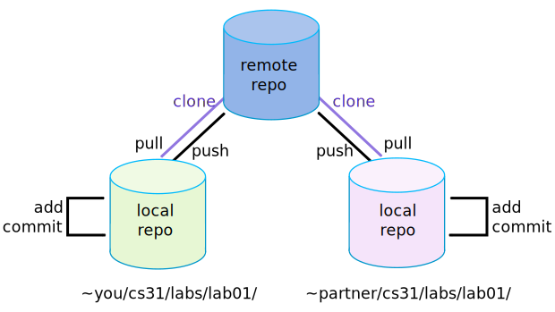

Git is a **Distributed Version Control System (VCS)** open source. A VCS keeps track of every modification to the code in a special kind of database. If a mistake is made, developers can turn back the clock using rollback or revert and compare earlier versions of the code to help fix the mistake while minimizing disruption to all team members.

## Staging and Committing the Changes
Git has something called the “staging area” or “index”. This is an intermediate area where _commits can be formatted_ _and reviewed_ before completing the commit. It is possible to add specific file to the staging area before send them to the server.

## Branches
The Git feature that really makes it stand apart from nearly every other SCM out there is its branching model. **_Git branches are effectively a pointer to a snapshot of your changes_**. When you want to add a new feature or fix a bug you spawn a new branch to encapsulate your changes. The diagram below shows the master branch. We always create branches for features in our project.

# Merging
The `git merge` command lets you take the independent lines of development created by git branch and integrate them into a single branch. It will combine multiple sequences of commits into one unified history. In real projects, there can be conflicts when a merge is being done. This means the same line of code was changed in each branch, and Git does not know which one to keep as the true change. Resolving the conflict is something which comes with experience, so as you work more with Git you will be able to get the hang of resolving conflicts.
# The Remote Git Repository

Each developer will work in their local repository but eventually, they will push the code into a remote repository. Once the code is in the remote repository, other developers can see and modify that code.

## Fetch
The `git fetch` command downloads commits, files, and refs from a remote repository into your local repo. Fetching is what you do when you want to see what everybody else has been working on.`git pull` and `git fetch` commands are available to accomplish the task. You can consider `git fetch` the 'safe' version of the two commands. It will download the remote content but not update your local repo's working state, leaving your current work intact
## Pull
The `git pull` command is used to fetch and download content from a remote repository and immediately update the local repository to match that content. Merging remote upstream changes into your local repository is a common task in Git-based collaboration workflows. The `git pull` command is actually a combination of two other commands, `git fetch` followed by `git merge`.
## Push
The `git push` command is used to upload local repository content to a remote repository. Pushing is how you transfer commits from your local repository to a remote repo.

# Useful Commands
| command        | description                                                                                                                                                                                                                                                          |
| -------------- | -------------------------------------------------------------------------------------------------------------------------------------------------------------------------------------------------------------------------------------------------------------------- |
| `git branch`   | This command is your general-purpose branch administration tool. It lets you create isolated development environments within a single repository.                                                                                                                    |
| `git checkout` | In addition to checking out old commits and old file revisions, git checkout is also the means to navigate existing branches. Combined with the basic Git commands, it’s a way to work on a particular line of development.                                          |
| `git clean`    | Removes untracked files from the working directory. This is the logical counterpart to git reset, which (typically) only operates on tracked files.                                                                                                                  |
| `git clone`    | Creates a copy of an existing Git repository. Cloning is the most common way for developers to obtain a working copy of a central repository.                                                                                                                        |
| `git commit`   | Takes the staged snapshot and commits it to the project history. Combined with git add, this defines the basic workflow for all Git users.                                                                                                                           |
| `git config`   | A convenient way to set configuration options for your Git installation. You’ll typically only need to use this immediately after installing Git on a new development machine.                                                                                       |
| `git fetch`    | Fetching downloads a branch from another repository, along with all of its associated commits and files. But, it doesn't try to integrate anything into your local repository. This gives you a chance to inspect changes before merging them with your project.     |
| `git init`     | Initializes a new Git repository. If you want to place a project under revision control, this is the first command you need to learn.                                                                                                                                |
| `git log`      | Lets you explore the previous revisions of a project. It provides several formatting options for displaying committed snapshots.                                                                                                                                     |
| `git merge`    | A powerful way to integrate changes from divergent branches. After forking the project history with git branch, git merge lets you put it back together again.                                                                                                       |
| `git pull`     | Pulling is the automated version of git fetch. It downloads a branch from a remote repository, then immediately merges it into the current branch. This is the Git equivalent of svn update.                                                                         |
| `git push`     | Pushing is the opposite of fetching (with a few caveats). It lets you move a local branch to another repository, which serves as a convenient way to publish contributions. This is like svn commit, but it sends a series of commits instead of a single changeset. |
| `git rebase`   | Rebasing lets you move branches around, which helps you avoid unnecessary merge commits. The resulting linear history is often much easier to understand and explore.                                                                                                |
| `git reflog`   | Git keeps track of updates to the tip of branches using a mechanism called reflog. This allows you to go back to changesets even though they are not referenced by any branch or tag.                                                                                |
| `git remote`   | A convenient tool for administering remote connections. Instead of passing the full URL to the fetch, pull, and push commands, it lets you use a more meaningful shortcut.                                                                                           |
| `git reset`    | Undoes changes to files in the working directory. Resetting lets you clean up or completely remove changes that have not been pushed to a public repository.                                                                                                         |
| `git revert`   | Undoes a committed snapshot. When you discover a faulty commit, reverting is a safe and easy way to completely remove it from the code base.                                                                                                                         |
| `git revert`   | Displays the state of the working directory and the staged snapshot. You’ll want to run this in conjunction with git add and git commit to see exactly what’s being included in the next snapshot.                                                                   |

# Link
Official page: https://git-scm.com/
All commands: https://git-scm.com/docs

---

**Tag Obsidian:** #git 